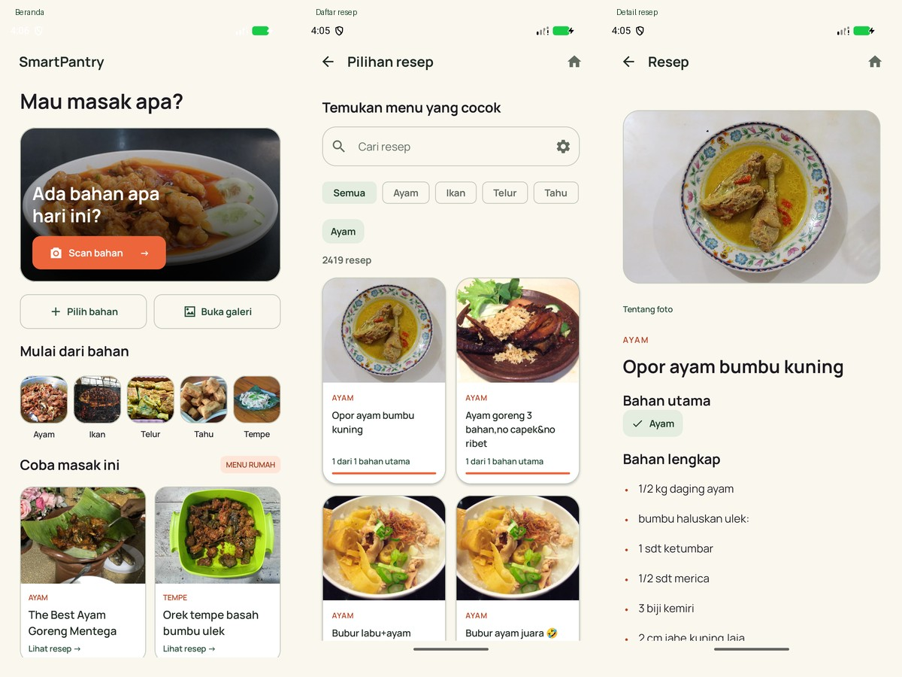

# SmartPantry

SmartPantry adalah aplikasi Android untuk mengenali bahan masakan dari foto dan mencari resep dari bahan yang tersedia. Kami menggunakan model YOLO11n v2, database resep lokal, dan foto hidangan asli. Deteksi serta pencarian resep berjalan di perangkat tanpa internet.



## Menjalankan project

Clone repository, buka folder yang berisi `settings.gradle.kts` di Android Studio, lalu gunakan Gradle JDK 21 dan SDK Platform 36. Pilih konfigurasi `app` dan jalankan pada emulator atau ponsel Android 8 ke atas.

Panduan lengkap: **[SETUP.md](SETUP.md)**.

```powershell
git clone https://github.com/Ferrs05/SmartPantry-.git
cd SmartPantry-
# Setelah JDK dan Android SDK dikonfigurasi:
.\gradlew.bat :app:assembleDebug
```

APK debug: `app/build/outputs/apk/debug/app-debug.apk`. Build pertama membutuhkan internet untuk mengunduh Gradle dan dependency. Anda tidak memerlukan API key atau akun untuk menjalankan aplikasi.

## Fitur

- Ambil foto dengan kamera atau pilih dari galeri.
- Kenali 18 kelas bahan dan tampilkan kotak deteksi pada foto.
- Tambah atau hapus bahan sebelum mencari resep.
- Cari resep, filter kategori, dan pilih resep yang bahan utamanya tersedia.
- Buka bahan lengkap dan langkah memasak dari SQLite.
- Buka dua resep pilihan langsung dari beranda.

Kamera bekerja per foto. Foto kamera berada di memori; aplikasi membaca foto galeri melalui URI. Aplikasi tidak mengunggah foto ke server dan tidak meminta izin INTERNET. Tautan kredit foto dapat membuka browser eksternal.

## Model dan data

| Komponen | Isi |
|---|---|
| Detektor | YOLO11n v2, FLOAT32, LiteRT, CPU 2 thread |
| Input | RGB, letterbox 512 × 512, NCHW `[1,3,512,512]`, normalisasi `/255` |
| Output | `[1,22,5376]`: kotak xywh dan skor 18 kelas |
| Pascaproses | Confidence 0,25; NMS per kelas IoU 0,7; maksimal 300 deteksi |
| Resep | 9.272 resep: ayam, ikan, tahu, telur, tempe |
| Foto | 65 foto asli, dipetakan ke 2.477 resep; tersedia offline |

Kelas bahan: ayam, bawang merah, bawang putih, cabai, tomat, telur, tahu, tempe, ikan, jagung, wortel, bayam, daun bawang, kacang panjang, kangkung, kol, terong, dan kentang.

Model ada di `app/src/main/assets/best.tflite`; konfigurasi tensor dan kelas ada di `android_config.json`. SHA256 model v2: `89f56ff5ed3ca6c80501612d0ef968dec2d53b62c2b3b23393be8bf130aa48c1`.

Kami mengambil resep dari [canggih / Indonesian Food Recipes](https://www.kaggle.com/datasets/canggih/indonesian-food-recipes). Lima kategori sumber memiliki 9.793 baris. Kami membuang 490 duplikat dan 31 resep tanpa bahan yang didukung. Teks bahan dan langkah asli tetap tersedia. `recipe_provenance.json` mencatat sumber, hitungan, dan hash CSV.

Foto berasal dari Wikimedia Commons. Foto merupakan contoh hidangan yang sesuai, bukan foto asli masing-masing penulis resep. Beberapa variasi resep memakai foto hidangan yang sama. **6.795 resep masih tanpa foto, termasuk beberapa menu harian.** Pemetaan tidak memakai foto kategori sebagai pengganti. Sumber, fotografer, lisensi, dan perubahan ada di [PHOTO_SOURCES.md](PHOTO_SOURCES.md).

Foto memakai WebP, ukuran maksimal 960 piksel, decoding di thread IO, dan cache bitmap 8 MB. Batas cache tersebut bukan batas seluruh RAM aplikasi.

## Rekomendasi resep

Coverage menghitung jumlah jenis bahan tersedia dibagi jumlah jenis bahan yang didukung pada resep. Kandidat harus memiliki setidaknya satu bahan cocok. Pada tampilan, kami mengutamakan coverage, lalu ketersediaan foto; urutan berikutnya mengikuti ranking domain.

Coverage 100% berarti bahan yang dikenali aplikasi tersedia. Pengguna tetap perlu memeriksa bumbu, bahan lain, dan takarannya pada detail resep.

## Struktur

```text
app/       Compose, ViewModel, CameraX, tema, dan aset offline
data/      Room, repository resep, LiteRT, prapemrosesan foto
domain/    Kontrak, model data, ranking, letterbox, decode dan NMS
tools/     Persiapan data/foto, audit aset, dan packaging
gradle/    Gradle wrapper
test-evidence/  Preview UI dan bukti validasi yang dipilih
```

Stack: Kotlin 2.1.20, Jetpack Compose, CameraX, Room 2.7.2, LiteRT 1.4.2, AGP 8.9.2, Gradle 8.11.1. Minimum SDK 26; compile/target SDK 36. Versi aplikasi: `0.3.0-v2-ui`.

## Status validasi

Build UI versi 0.3 berhasil. Enam tes instrumentasi offline lulus, termasuk kamera, inferensi, database, alur UI, dan cache foto. Alur UI diulang setelah gangguan System UI/Pixel Launcher emulator; preview beranda diambil setelah foto selesai dimuat. APK debug saat validasi berukuran 62,7 MB.

Rincian: [COMPACT_UI_VALIDATION.md](COMPACT_UI_VALIDATION.md). Tes emulator tidak membuktikan akurasi foto ponsel, performa perangkat fisik, atau kompatibilitas Android 8. Cakupan foto dan pemetaan alias bahan masih perlu dilengkapi. Repository aplikasi ini tidak menjalankan pelatihan model.

## Sumber dan lisensi aset

- Resep: URL sumber ada di SQLite dan `recipe_provenance.json`.
- Foto: atribusi serta lisensi per foto ada di `photo_sources.json`, [PHOTO_SOURCES.md](PHOTO_SOURCES.md), dan layar kredit foto.
- Font: berkas SIL Open Font License ada di `app/src/main/assets/licenses/`.
- Model v2: [artefak sumber di Drive](https://drive.google.com/file/d/1G0u9uWx2v7inTU5KLHR2UlQSEHJedX-l/view).

Repository ini belum menetapkan lisensi umum untuk source project. Aset pihak ketiga mengikuti lisensi sumber masing-masing.
